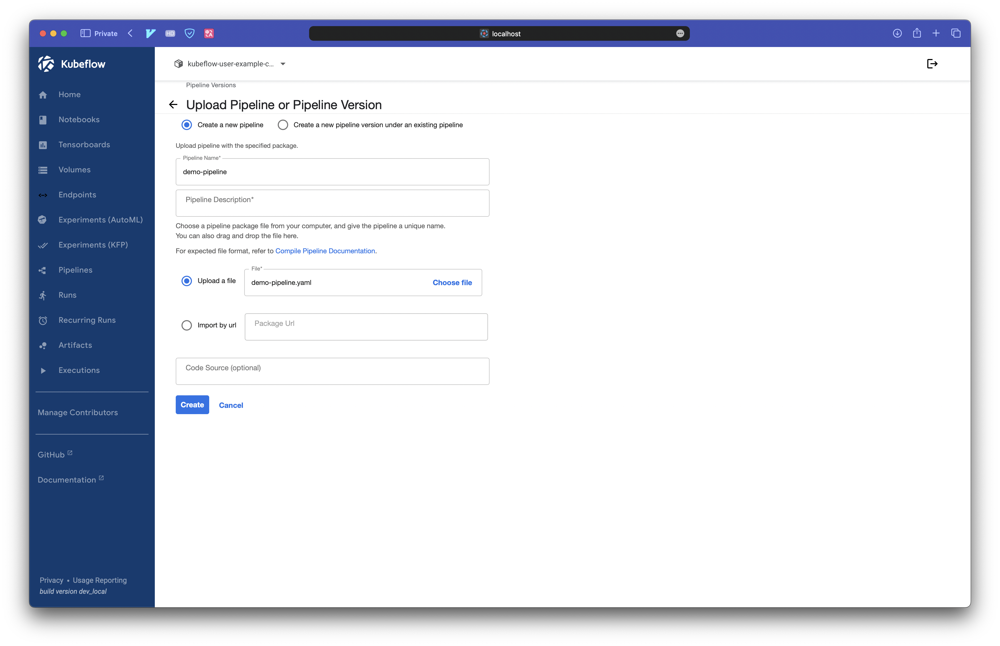
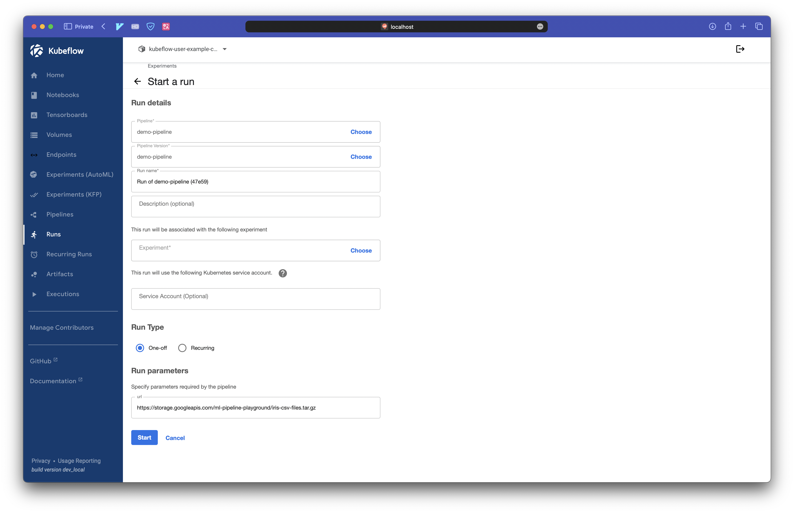

# kubeflow-playground

- [kubeflow-playground](#kubeflow-playground)
  - [prerequisites](#prerequisites)
  - [setup](#setup)
    - [install kubeflow](#install-kubeflow)
    - [local dev](#local-dev)
  - [playground](#playground)
    - [ping](#ping)
    - [compile and run](#compile-and-run)
  - [cleanup](#cleanup)

## prerequisites

- [Rancher Desktop](https://github.com/rancher-sandbox/rancher-desktop): `1.9.0`
- Kubernetes: `v1.25.10`
- kubectl `v1.26.0`
- Helm: `v3.11.2`
- [PDM](https://pdm.fming.dev/latest/)

## setup

### install kubeflow

`./scripts/install.sh`

### local dev

`pdm install`

## playground

port forward kubeflow server

```sh
kubectl port-forward svc/istio-ingressgateway -n istio-system 8080:80
```

visit [kubeflow web ui](http://localhost:8080) after port-forwarding with credential

```sh
email: user@example.com
password: 12341234
```

### ping

```sh
$ pdm run kubeflow_playground/ping.py | jq -c '.[].name'

"[Demo] XGBoost - Iterative model training"
"[Demo] TFX - Taxi tip prediction model trainer"
"[Tutorial] Data passing in python components"
"[Tutorial] DSL - Control structures"
```

### compile and run

```sh
pdm run kubeflow_playground/pipelines/demo.py
```

upload the pipeline via [kubeflow web ui](http://localhost:8080/_/pipeline/?ns=kubeflow-user-example-com#/pipeline_versions/new)



start the run



## cleanup

TODO:
